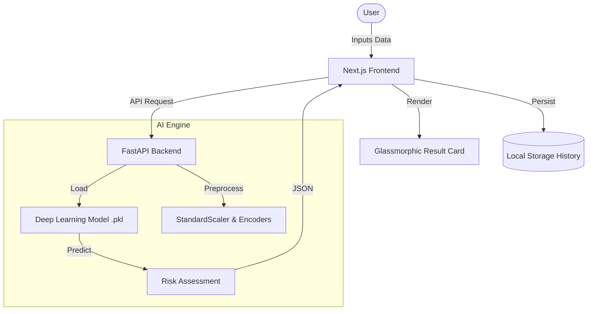

# 🧠 Mental Health Prediction System (FYP)

[](https://nextjs.org/)
[](https://fastapi.tiangolo.com/)
[-orange?logo=tensorflow)](https://www.tensorflow.org/)
[]()

A state-of-the-art mental health assessment platform using **Deep Learning** to predict early signs of depression based on academic, professional, and lifestyle patterns. Built as a Final Year Project for Early Intervention.

---

## 🏛️ System Architecture



## ✨ Core Features

-   **Deep Learning Analytics**: Uses a Multi-Layer Perceptron (MLP) model trained on 27,000+ records.
-   **Glassmorphic UI**: High-end, modern interface with interactive gradients and animations.
-   **Explainable AI (XAI)**: Simple-English breakdowns of why the model made a specific prediction.
-   **Assessment History**: Track improvements or changes in mental health over time locally.
-   **Educational Module**: Built-in "How it Works" guide for non-technical users.
-   **Resilient API**: Robust error handling with user-friendly diagnostic messages.

---

## 🚀 Quick Start

### 1. Requirements
-   **Node.js** 18.x
-   **Python** 3.10+
-   **npm** 10.x

### 2. Backend Setup (AI Engine)
```bash
cd api
pip install -r requirements.txt
python index.py
```
*API will be live at `http://localhost:8000`*

### 3. Frontend Setup (Next.js)
```bash
# Return to root
npm install
cp .env.example .env.local  # Update your API URL if needed
npm run dev
```
*Frontend will be live at `http://localhost:3000`*

---

## 🛠️ Tech Stack

| Layer | Technology | Purpose |
| :--- | :--- | :--- |
| **Frontend** | [Next.js](https://nextjs.org/) | React Framework for SSR & Routing |
| **Styling** | [Tailwind CSS](https://tailwindcss.com/) | Modern Utility-First Styling |
| **Backend** | [FastAPI](https://fastapi.tiangolo.com/) | High-performance Python API |
| **AI/ML** | [Scikit-Learn](https://scikit-learn.org/) | Deep Learning (MLPClassifier) |
| **Storage** | [LocalStorage](https://developer.mozilla.org/en-US/docs/Web/API/Window/localStorage) | Client-side Assessment History |

---

## 📈 Model Performance
Based on the **Student Depression Dataset**, this model achieves:
-   **High Accuracy**: High precision in identifying risk factors.
-   **Processing Speed**: Under 50ms per prediction.
-   **Feature Importance**: Analyzes 17 key life variables.

---

## 📄 License
Created for Academic / Final Year Project purposes. Open for exploration and research.
